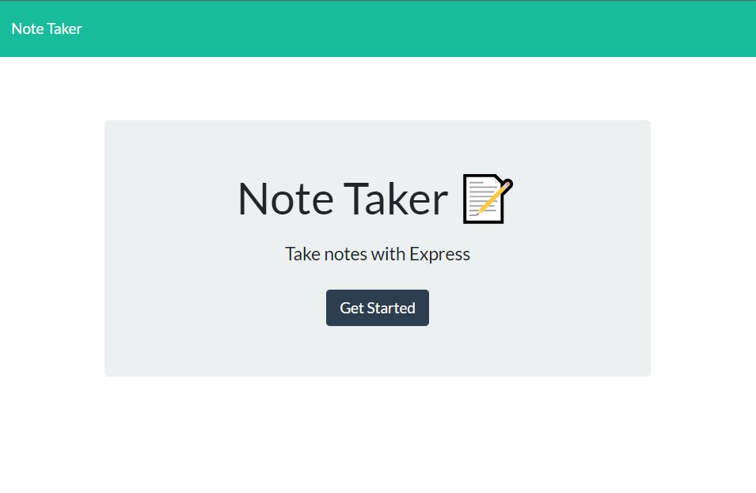
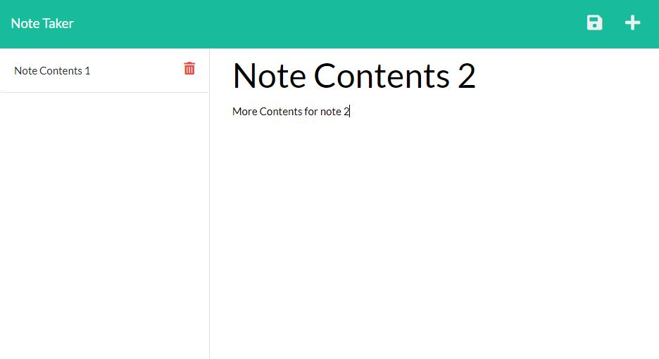

# Notary Express - The Note Taker App

## Description:
Have you ever wanted to take notes on your computer but no where to do it? Now introducting Notary Express! The one stop shop for all note taking on the web browser! Visit the deployed link in the screenshots section, and begin! Notes save to localStorage, and can also be deleted if the user decides to do so. Enjoy the wonders of saved notes without having to worry about the pesky refresh deleting everything!

## Tables of Contents:
* [Technologies](#technologies)
* [NPM Packages](#npm-packages)
* [Screenshot](#screenshot)
* [Installation](#installation)
* [Usage](#usage)
* [Author(s)](#authors)
* [Contact Info](#contact-info)

## Technologies:
* HTML
* CSS
* JavaScript
* JQuery
* Node.js (npm)

## NPM Packages:
* [express](https://www.npmjs.com/package/express)
* [fs](https://www.npmjs.com/package/fs)
* [path](https://www.npmjs.com/package/path)

## Screenshot:
Starting Screen:

Application Screen:

[Heroku Live Deployed Link](https://murmuring-tor-25321.herokuapp.com/)

## Installation:
* Download the available Zip file or clone to your local machine. Open terminal and run the following commands:
* `npm init` and `npm install` to start your package downloading. Once everything has been downloaded run command: `npm start` to begin the server.
* Once the terminal states "Server running on port 3001" you are all set to begin on the "localhost:3001" link in your browser.
* `ctrl + c` to stop the server in the local terminal.

## Usage:
* You can visit the Heroku Deployed Link to begin your note taking session! Everything will be saved to localStorage so nothing will be erased from refreshing! Once on the starting screen, press the `Get Started` button to begin! Enter your Note Title and Note Text/Contents and click on the save icon on the top right, and begin to see your notes pile up! Each note will have a delete icon on the right side, incase you'd like to delete said note.

## Author(s):
* Jeffrey Young

## Contact Info:
[GitHub](https://github.com/jeffymiyoung)

---
© 2022 Notary Express
